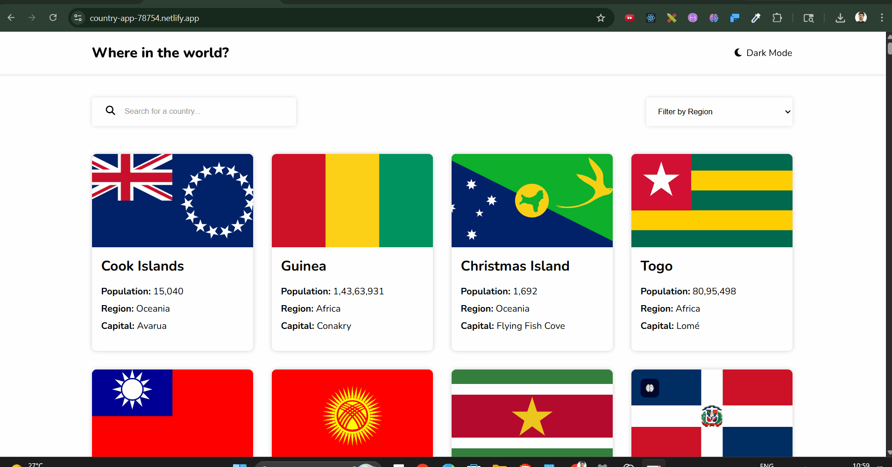
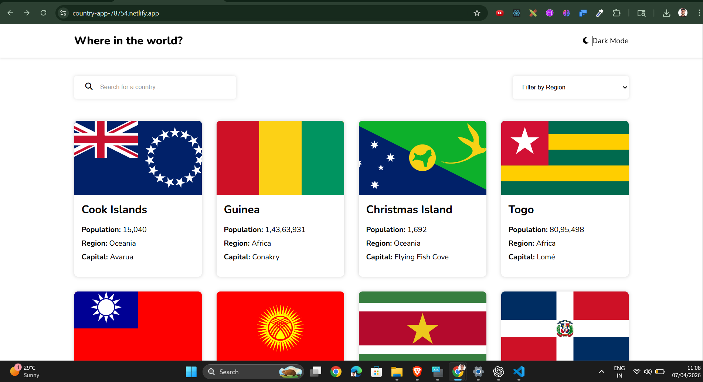
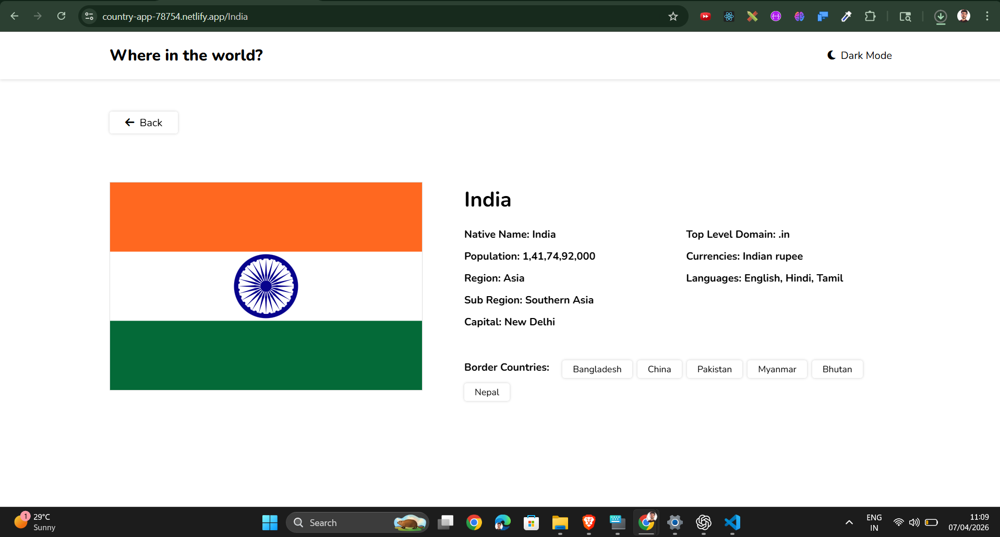
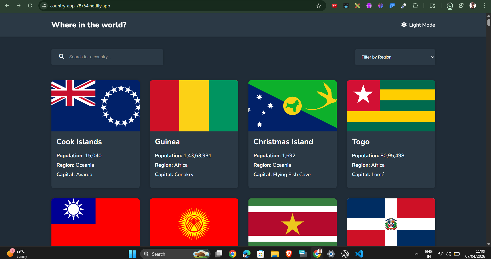

# 🌍 Country Explorer App


🔗 **Live Demo:** https://country-app-78754.netlify.app/

---

## 📌 Overview

The **Country Explorer App** is a modern React application that allows users to explore countries with detailed insights like population, region, capital, languages, and borders.

Built with performance and clean UI in mind, this project demonstrates real-world frontend development skills including API integration, routing, and optimization.

---

## 🎥 Live Preview

<p align="center">
  
</p>

---

## 🚀 Features

✨ Core Features

* 🌐 View all countries
* 🔍 Search by country name
* 🌎 Filter by region
* 📊 Detailed country information

⚡ Advanced Features

* 🚧 Border country navigation
* ⚡ Optimized API requests (fields-based)
* 🌙 Dark/Light theme toggle
* ⏳ Skeleton loading (Shimmer UI)
* 📱 Fully responsive design

---

## 🛠️ Tech Stack

| Category   | Technologies         |
| ---------- | -------------------- |
| Frontend   | React.js, JavaScript |
| Styling    | CSS3                 |
| Routing    | React Router DOM     |
| API        | REST Countries API   |
| Deployment | Netlify              |

---

## 📂 Project Structure

```bash
country-app/
│
├── components/
├── hooks/
├── public/
│   └── _redirects
├── App.jsx
├── index.jsx
└── package.json
```

---

## ⚙️ Installation

```bash
git clone https://github.com/ashish78754/country_API_App.git
cd country_API_App
npm install
npm run dev
```

---

## 🌐 API Optimization

To improve performance, the app fetches only required fields:

```
https://restcountries.com/v3.1/all?fields=name,flags,population,region,capital
```

✔ Faster load time
✔ Reduced bandwidth
✔ Clean data handling

---

## 🚀 Deployment (Netlify Fix)

SPA routing handled using:

```
/*    /index.html   200
```

or via `netlify.toml`

---

## 🧠 Key Learnings

* Handling real-world API limitations
* Optimizing frontend performance
* Dynamic routing using React Router
* Fixing SPA deployment issues
* Writing scalable component-based code

---

## 📸 Screenshots

<p align="center">
  
  
</p>

<p align="center">
  
</p>

---

## 🔮 Future Improvements

* 🔍 Debounced search
* 🌍 Region dropdown filter
* 💾 API caching
* ⚡ Lazy loading
* 📈 Performance optimization

---

## 🤝 Contributing

Contributions are welcome!

```bash
1. Fork the repo
2. Create a branch
3. Make changes
4. Submit PR
```

---

## 👨‍💻 Author

**Ashish Kumar**

📧 [ashishkumar78754@gmail.com](mailto:ashishkumar78754@gmail.com)
🔗 https://github.com/ashish78754

---

## ⭐ Show Your Support

If you like this project:

👉 Give it a ⭐ on GitHub
👉 Share it with others

---
